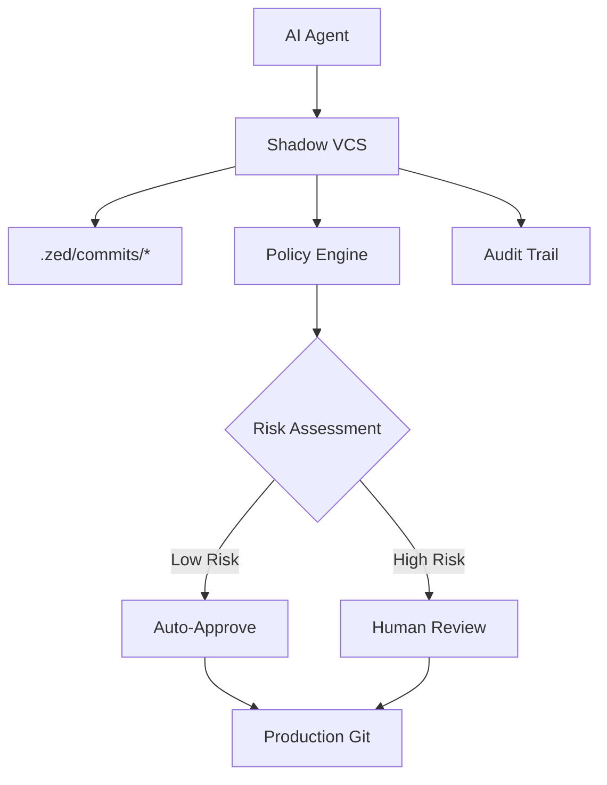

# Shadow VCS v0.1

A local-first "staging VCS" that lets AI agents commit code safely *outside* a production Git repository.

## Overview

Shadow VCS provides **isolation**, **provenance**, and **policy enforcement** for AI-generated code changes:

- **Isolation** – Agent output lives in `.zed/commits/*` until humans merge
- **Provenance** – Every commit carries a **fingerprint** with risk metrics stored in `.zed/fingerprints/*.json`  
- **Policy enforcement** – YAML rules auto-approve trivial edits, block dangerous ones
- **Audit-grade log** – `index.sqlite` records who/what/when for compliance

Think of it as a **buffered quarantine**—like email spam folders or CI artifact bins—between autonomous agents and trusted code.



## Installation

### Prerequisites

- Python 3.11+
- Git (for production workflows)

### Install from Source

```bash
git clone https://github.com/AKIFQ/zed.git
cd zed
pip install -e .
```

### Install from PyPI (Coming Soon)

```bash
pip install zed-shadow-vcs
```

## Quick Start

### 1. Initialize a Shadow VCS Repository

```bash
mkdir my-project
cd my-project
zed init
```

This creates a `.zed/` directory with:
- `commits/` - Quarantined commits  
- `fingerprints/` - Risk assessment data
- `index.sqlite` - Audit database
- `constraints.yaml` - Policy rules

### 2. Create Your First Commit

```bash
echo 'print("Hello Shadow VCS!")' > hello.py
zed commit -m "Add hello script" hello.py
```

Output:
```
Created commit a1b2c3d4 (auto-approved by policy)
  Files: 1
  Lines: +1 -0
  Risk score: 0.0
```

### 3. Check Status

```bash
zed status --all
```

Output:
```
a1b2c3d4 approved 2024-01-15 14:30 user: Add hello script
```

### 4. Review a Commit

```bash
zed review a1b2c3d4
```

Shows detailed commit information including diff, risk metrics, and security assessment.

### 5. Human Workflow (for pending commits)

```bash
# For commits requiring review
zed status                    # Show pending commits
zed review <commit-id>        # Review details
zed approve <commit-id>       # Apply to working tree
# OR
zed reject <commit-id> -r "Security concern"
```

## Policy Configuration

Edit `.zed/constraints.yaml` to customize approval rules:

```yaml
rules:
  # Auto-approve documentation
  - match: "*.md"
    auto_approve: true
  
  # Auto-approve small changes
  - match: "*"
    condition: "risk_score < 0.3 and lines_added < 50"
    auto_approve: true
  
  # Require admin for high-risk changes
  - match: "*"
    condition: "risk_score > 0.7"
    require_role: "admin"
  
  # Default: require review
  - match: "*"
    auto_approve: false
```

### Supported Conditions

- `risk_score` (0-1 float)
- `lines_added` (integer)
- `lines_deleted` (integer)

### Test Policy Rules

```bash
zed policy test \
  --rule '{"match": "*.py", "condition": "risk_score < 0.5"}' \
  --context '{"risk_score": 0.2, "lines_added": 10, "lines_deleted": 0}'
```

## Risk Assessment

Shadow VCS automatically calculates risk scores based on:

- **Change size** - Large changes = higher risk
- **File count** - Many files = higher risk  
- **Security patterns** - Files matching sensitive patterns (`*.key`, `config`, `secret`) = high risk
- **Binary files** - Large binaries (>500KB) = high risk
- **Deletion patterns** - Heavy deletions = higher risk

## AI Agent Integration

### LangChain Example (Coming in v0.2)

```python
from zed.integrations.langchain import ShadowVCSWrapper

# Wrap your agent
agent = ShadowVCSWrapper(your_langchain_agent)

# Agent changes are automatically committed to Shadow VCS
result = agent.run("Refactor the authentication module")
```

### Custom Integration

```python
from zed.core.repo import Repository
from zed.core.commit import CommitManager

# Initialize
repo = Repository(".")
commit_mgr = CommitManager(repo)

# Create commit
files = [Path("modified_file.py")]
commit = commit_mgr.create_commit(
    message="AI: Refactored authentication",
    author="ai-agent-v1.2",
    files=files
)

print(f"Created commit {commit.id} - check zed status for approval")
```

## Commands Reference

| Command | Description |
|---------|-------------|
| `zed init` | Initialize Shadow VCS repository |
| `zed commit -m "msg" <files>` | Create new commit |
| `zed status [--all]` | Show commit status |
| `zed review <commit-id>` | Review commit details |
| `zed approve <commit-id>` | Approve and apply commit |
| `zed reject <commit-id>` | Reject commit |
| `zed policy test` | Test policy rules |

## Directory Structure

```
.zed/
├── commits/
│   └── <commit-uuid>/
│       ├── files/          # Committed file copies
│       ├── meta.json       # Commit metadata
│       └── diff.patch      # Unified diff
├── fingerprints/
│   └── <fingerprint-uuid>.json  # Risk assessments
├── index.sqlite           # Audit database
└── constraints.yaml       # Policy rules
```

## Security Considerations

- **Sandboxed evaluation** - Policy expressions use restricted Python `eval()`
- **File isolation** - Commits stored separately until approved
- **Audit trail** - All actions logged with timestamps
- **Risk assessment** - Automatic security pattern detection

## Development

### Setup Development Environment

```bash
git clone https://github.com/AKIFQ/zed.git
cd zed
python -m venv venv
source venv/bin/activate  # or `venv\Scripts\activate` on Windows
pip install -e .
pip install pytest
```

### Run Tests

```bash
pytest tests/ -v
```

### Pre-commit Hook

```bash
python scripts/prepush.py
```

This runs tests and cleans up the repository before pushing.

## Contributing

1. **Fork** the repository
2. **Create** a feature branch (`git checkout -b feature/amazing-feature`)
3. **Commit** your changes (`git commit -m 'Add amazing feature'`)
4. **Push** to the branch (`git push origin feature/amazing-feature`)
5. **Open** a Pull Request

### Development Guidelines

- Follow PEP 8 style guidelines
- Add tests for new functionality
- Update documentation as needed
- Ensure all tests pass before submitting PR

## Roadmap

### v0.2 (Planned)
- [ ] LangChain integration wrapper
- [ ] Git integration (automatic merge on approve)
- [ ] Web UI for commit review
- [ ] Advanced risk heuristics

### v0.3 (Future)
- [ ] Multi-user permissions
- [ ] Custom risk assessment plugins
- [ ] Slack/Teams notifications
- [ ] Export to standard Git patches

## License

MIT License - see [LICENSE](LICENSE) file for details.

## Citation

```bibtex
@software{shadow_vcs,
  title={Shadow VCS: Local-first Staging VCS for AI Agents},
  author={Shadow VCS Contributors},
  year={2024},
  url={https://github.com/AKIFQ/zed}
}
```

## Support

- **Issues**: [GitHub Issues](https://github.com/AKIFQ/zed/issues)
- **Discussions**: [GitHub Discussions](https://github.com/AKIFQ/zed/discussions)
- **Documentation**: [Wiki](https://github.com/AKIFQ/zed/wiki)

---

**Shadow VCS** - Because AI agents need training wheels too! 🚀 